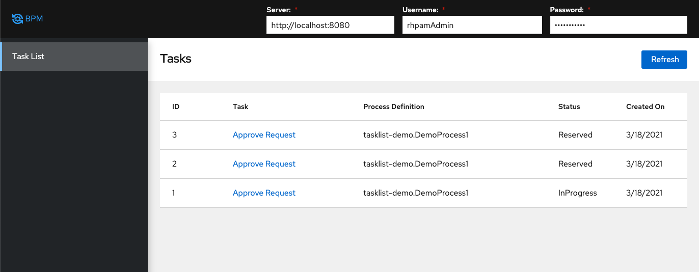

# RHPAM custom tasklist



## Prerequisites
RHPAM installed, Demo process with Human Task created and started.
[Enable CORS for Kie Server](https://access.redhat.com/solutions/3713131) executing following script using `jboss-cli.sh`
```
batch
/subsystem=undertow/configuration=filter/response-header=Access-Control-Allow-Origin:add(header-name="Access-Control-Allow-Origin", header-value="*")
/subsystem=undertow/server=default-server/host=default-host/filter-ref=Access-Control-Allow-Origin/:add()
/subsystem=undertow/configuration=filter/response-header=Access-Control-Allow-Methods:add(header-name="Access-Control-Allow-Methods",header-value="GET,POST, OPTIONS, PUT, DELETE")
/subsystem=undertow/server=default-server/host=default-host/filter-ref=Access-Control-Allow-Methods/:add()
/subsystem=undertow/configuration=filter/response-header=Access-Control-Allow-Headers:add(header-name="Access-Control-Allow-Headers",header-value="accept, authorization,content-type, x-requested-with")
/subsystem=undertow/server=default-server/host=default-host/filter-ref=Access-Control-Allow-Headers/:add()
/subsystem=undertow/configuration=filter/response-header=Access-Control-Allow-Credentials:add(header-name="Access-Control-Allow-Credentials", header-value="true")
/subsystem=undertow/server=default-server/host=default-host/filter-ref=Access-Control-Allow-Credentials/:add()
/subsystem=undertow/configuration=filter/response-header=Access-Control-Max-Age:add(header-name="Access-Control-Max-Age",header-value="2")
/subsystem=undertow/server=default-server/host=default-host/filter-ref=Access-Control-Max-Age/:add()
run-batch
```

## Running the application in dev mode with Quarkus backend

You can run your application in dev mode that enables live coding using:
```shell script
./mvnw compile quarkus:dev
```
Note: dev mode configured to use port 8181 to avoid conflicts with local RHPAM 

## Packaging and running the application with Quarkus backend
The application can be packaged using:
```shell script
./mvnw package -Dquarkus.package.type=uber-jar
```

The application is now runnable using `java -jar target/quarkus-app/quarkus-run.jar`.

## Package without Quarkus backend

You can create a busybox container using: 
```shell script
docker build -f Dockerfile.busybox -t rhpam-tasklist/demo .
```

Run container using:
```shell script
docker run -d -p 8081:80 rhpam-tasklist/demo 
```


